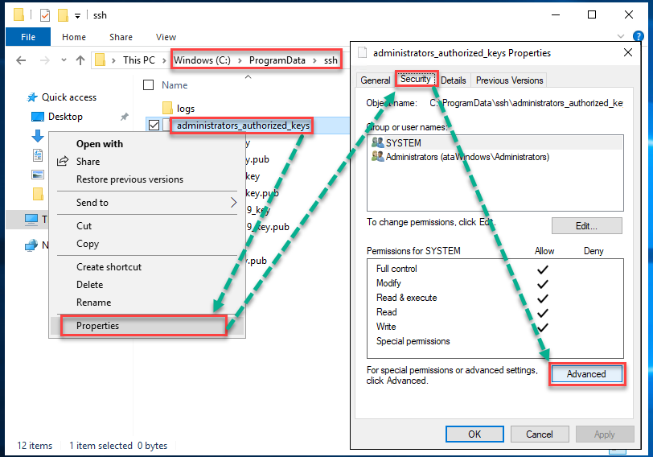
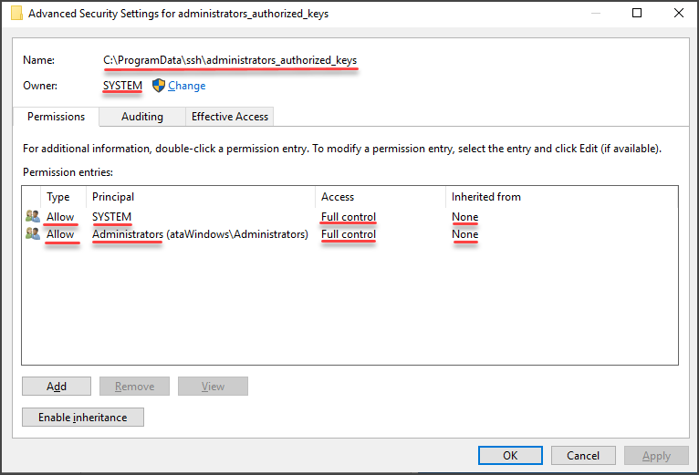

# ssh between two WSL2s
```txt
+---------------------------+     +---------------------------------------------------+
| host1 (windows)           |     | host2 (windows)                                   |
|                           |     | +-- services -------+                             |
| +-----------------------+ |     | | sshd service      |                             |
| | host1-wsl        <---------+  | | ssh-agent service |                             |
| | ~/.ssh/id_ed25519     | |  |  | +-------------------+                             |
| | ~/.ssh/id_ed25519.pub | |  |  | C:\ProgramData\ssh\administrators_authorized_keys |
| +-----------------------+ |  |  |                                                   |
+---------------------------+  |  |  +------------------------+                       |
                               +------>host2-wsl              |                       |
                                  |  | ~/.ssh/authorized_keys |                       |
                                  | +-------------------------+                       |
                                  +---------------------------------------------------+
```

## References (2022-09-04):
- https://docs.microsoft.com/en-us/windows-server/administration/openssh/openssh_install_firstuse?tabs=powershell
- https://adamtheautomator.com/openssh-windows/


## Index
1. [Setup ssh server on host 2](./ssh-between-wsl2s.md#setup-ssh-server-on-host-2)
1. [Setup ssh client on host1-wsl](./ssh-between-wsl2s.md#setup-ssh-client-on-host1-wsl)
1. [Setup ssh server on host2-wsl](./ssh-between-wsl2s.md#authorize-host1-wsl-on-host2-wsl)
1. [Authorize host1-wsl on host2](./ssh-between-wsl2s.md#authorize-host1-wsl-on-host2)
1. [Authorize host1-wsl on host2-wsl](./ssh-between-wsl2s.md#authorize-host1-wsl-on-host2-wsl)


## Setup ssh server on host 2
```powershell
# host2
Add-WindowsCapability -Online -Name OpenSSH.Client~~~~0.0.1.0
Add-WindowsCapability -Online -Name OpenSSH.Server~~~~0.0.1.0
New-ItemProperty -Path "HKLM:\SOFTWARE\OpenSSH" -Name DefaultShell -Value "C:\Windows\System32\WindowsPowerShell\v1.0\powershell.exe" -PropertyType String -Force
Set-Service -Name sshd -StartupType 'Automatic'
Set-Service -Name ssh-agent -StartupType 'Automatic'
Start-Service sshd
Start-Service ssh-agent
```

## Setup ssh client on host1-wsl
```bash
# usual package manager installation, mine is apt
sudo apt install ssh -y
# test localhost ssh, should work
ssh <user>@localhost

# generate key pair to authorize on host2 and host2-wsl.
ssh-keygen -t ed25519
# enter
# enter
# enter

sudo vim /etc/hosts
# add a line like this
# 192.168.0.113 <host2-arbitrary-name>

vim ~/.ssh/config
# add the following:
Host host2
    Hostname <host2-arbitrary-name>  # replace with same as /etc/hosts
    User <user>  # replace with your windows username of host2
    IdentityFile ~/.ssh/id_ed25519
```

## Authorize host1-wsl on host2
In my tests ssh-copy-id doesn't work targeting windows open ssh server, will have to copy public key out of band.
```bash
# on host1-wsl
cat ~/.ssh/id_ed25519.pub
# will output something like this:
# ssh-ed25519 AAAAC3NzaC1lZDI1NTE5AAAAIPTH3lZOKpspNQNKICsGXz49zaQF/AdN2QtdlaMDkyVG <user>@<host>
```

Copy output of command above to host2 C:\ProgramData\ssh\administrators_authorized_keys
```powershell
# host2
# warning this will truncate your administrators_authorized_keys
# if it exists add -Append to Out-File command
echo 'ssh-ed25519 AAAAC3NzaC1lZDI1NTE5AAAAIPTH3lZOKpspNQNKICsGXz49zaQF/AdN2QtdlaMDkyVG <user>@<host>' | Out-File C:\ProgramData\ssh\administrators_authorized_keys -Encoding UTF8
restart-service sshd
restart-service ssh-agent

# get the ACL currently assigned to the ssh_host_dsa_key file and copy that ACL to the administrators_authorized_keys file
get-acl C:\ProgramData\ssh\ssh_host_dsa_key | set-acl C:\ProgramData\ssh\administrators_authorized_keys
```

If the above command does not work change permissions manually to be owned by SYSTEM:





---
Test with:
```bash
# on host1-wsl
# host2 is the alias in ~/.ssh/config
# this should login directly without password
ssh host2

# for ssh access only, it is already possible, even tough not practical yet
# keep reading to make it more practical
ssh host2 -t 'C:\Windows\System32\bash.exe'
```

## Authorize host1-wsl on host2-wsl
```bash
# on host1-wsl
vim ~/.ssh/config
# add the following:
Host host2-wsl
    Hostname localhost
    User <user>  # replace with your linux username of host2-wsl
    ProxyJump host2

ssh-copy-id -i ~/.ssh/id_ed25519.pub host2-wsl
# password authentication this time

# test, should not require password this time
ssh host2-wsl
```